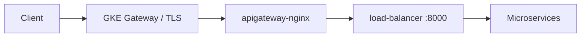

# pumpwood-deploy-ingress-gcp

Satellite deploy package for **Pumpwood GKE Gateway ingress** on
Kubernetes. It generates Gateway API manifests for a regional external
managed load balancer with TLS termination and HTTP-to-HTTPS redirect —
then hands them to
[`pumpwood-deploy`](https://github.com/Murabei-OpenSource-Codes/pumpwood-deploy)
for apply.

Developed by [Murabei Data Science](https://murabei.com). BSD-3-Clause.

<p align="center" width="60%">
   <br>

  <a href="https://en.wikipedia.org/wiki/Cecropia">
    Pumpwood is a native Brazilian tree
  </a> with a symbiotic relation to ants (Murabei)
</p>

---

## What it deploys

| Class | Role |
|-------|------|
| `IngressGCPGateway` | GKE regional Gateway ingress with Certificate Manager TLS |

### Manifests produced

**`IngressGCPGateway`** — 1 deploy object:

| Manifest | Kubernetes resources |
|----------|----------------------|
| `ingress_gcp_gateway__gateway` | Gateway `ingress-gcp-gateway`, HTTPRoutes for redirect and app traffic, `HealthCheckPolicy` |

TLS terminates at the GKE L7 regional external managed load balancer
using a regional Certificate Manager certificate referenced via
``networking.gke.io/cert-manager-certs``. HTTP requests are redirected
to HTTPS by an HTTPRoute filter.



The Gateway routes HTTPS traffic to the NGINX service deployed by
``ApiGatewayNoCertificate``. NGINX adds CORS and security headers;
Kong routes traffic to auth, datalake, and other Pumpwood services.

---

## Prerequisites

This package does **not** stand alone. Deploy it **after**
``StandardMicroservices`` (Kong, RabbitMQ, storage) and
``ApiGatewayNoCertificate`` so the ``apigateway-nginx`` Service
exists:

| Upstream | Default target | Port |
|----------|----------------|------|
| NGINX gateway | `apigateway-nginx` | `80` |
| Kong proxy | `load-balancer` | `8000` |
| Kong health | `load-balancer` | `8001` |

On GCP you also need:

- A **reserved regional external IP** whose name matches
  ``public_ip_name`` (``NamedAddress`` on the Gateway)
- DNS ``A`` record pointing ``server_name`` to that IP
- A **regional Certificate Manager certificate** in the same project
  and region (create with ``IngressGCPGateway.create_infrastructure``)
- A **regional managed proxy subnet** on the VPC (created by
  ``create_infrastructure``)
- **Gateway API** enabled on the GKE cluster (``--gateway-api=standard``,
  also handled by ``create_infrastructure``)

The GKE Gateway controller does **not** support ``ManagedCertificate``.
Use Certificate Manager instead.

Pair with
[`pumpwood-deploy-ingress-api-gateway`](https://github.com/Murabei-OpenSource-Codes/pumpwood-deploy-ingress-api-gateway)
(``ApiGatewayNoCertificate``) targeting service ``apigateway-nginx``
on port 80.

---

## Installation

```bash
pip install pumpwood-deploy-ingress-gcp
```

Requires ``pumpwood-deploy`` (declared as a dependency).

---

## Quick start

### Step 1 — GCP infrastructure (one-time)

Run before the first Gateway deploy. The certificate script prints a
DNS authorization CNAME — add it at your DNS provider and wait for
propagation before applying the Gateway.

```python
from pumpwood_deploy_ingress_gcp import IngressGCPGateway

IngressGCPGateway.create_infrastructure(
    region="southamerica-east1",
    project_id="my-gcp-project",
    server_name="app.example.com",
    cluster_name="my-gke-cluster",
    network_name="default",
    dns_authorization_name="ingress-gcp-gateway-dns-auth",
    certificate_name="ingress-gcp-gateway-certificate",
)

IngressGCPGateway.check_infrastructure(
    region="southamerica-east1",
    project_id="my-gcp-project",
    certificate_name="ingress-gcp-gateway-certificate",
)
```

Repeat ``check_infrastructure`` until the certificate state is
``ACTIVE``.

### Step 2 — Deploy NGINX gateway and Gateway ingress

```python
import os
from dotenv import load_dotenv
from pumpwood_deploy.deploy import DeployPumpWood
from pumpwood_deploy_api_gateway import ApiGatewayNoCertificate
from pumpwood_deploy_ingress_gcp import IngressGCPGateway

load_dotenv()

deploy = DeployPumpWood(...)

deploy.add_microservice(
    ApiGatewayNoCertificate(
        version=os.getenv("API_GATEWAY"),
        repository="my-registry.example.com/",
        health_check_url="health-check/pumpwood-auth-app/",
    ))

deploy.add_microservice(
    IngressGCPGateway(
        server_name="app.example.com",
        public_ip_name="pumpwood-gateway-ip",
        target_service="apigateway-nginx",
        certificate_name="ingress-gcp-gateway-certificate",
        health_check_path="/health-check/pumpwood-auth-app/",
    ))

deploy.create_deploy_files()
deploy.deploy_microservices()
```

### Environment variables

```bash
API_GATEWAY=1.2.0    # pumpwood-nginx-without-ssl (no TLS on NGINX)
```

If the rendered manifest matches the cluster, ``kubectl apply`` produces
no changes — safe for rolling image updates.

---

## Configuration reference

### `IngressGCPGateway` (instance)

| Parameter | Required | Default | Description |
|-----------|----------|---------|-------------|
| `server_name` | Yes | — | DNS hostname for Gateway HTTPRoutes |
| `public_ip_name` | Yes | — | GCP reserved external IP name (`NamedAddress`) |
| `target_service` | No | `apigateway-nginx` | Kubernetes Service for HTTPS routing |
| `certificate_name` | No | `ingress-gcp-gateway-certificate` | Regional Certificate Manager cert name |
| `health_check_path` | No | `/health-check/pumpwood-auth-app/` | Gateway health check request path |

### `IngressGCPGateway.create_infrastructure` (classmethod)

| Parameter | Required | Default | Description |
|-----------|----------|---------|-------------|
| `region` | Yes | — | GCP region for Gateway and certificate |
| `project_id` | Yes | — | GCP project ID |
| `server_name` | Yes | — | DNS hostname for certificate authorization |
| `cluster_name` | Yes | — | GKE cluster to enable Gateway API on |
| `network_name` | No | `default` | VPC network for the proxy subnet |
| `dns_authorization_name` | No | `ingress-gcp-gateway-dns-auth` | Certificate Manager DNS auth name |
| `certificate_name` | No | `ingress-gcp-gateway-certificate` | Regional certificate name to create |

### `IngressGCPGateway.check_infrastructure` (classmethod)

| Parameter | Required | Default | Description |
|-----------|----------|---------|-------------|
| `region` | Yes | — | GCP region of the certificate |
| `project_id` | Yes | — | GCP project ID |
| `certificate_name` | No | `ingress-gcp-gateway-certificate` | Certificate to describe |

---

## Health check

The Gateway ``HealthCheckPolicy`` probes the target Service on port 80.
The default path is:

```
GET /health-check/pumpwood-auth-app/
```

Use the same path on ``ApiGatewayNoCertificate`` so NGINX and the
load balancer agree on readiness. Auth is the usual canary because it
is deployed early in most Pumpwood stacks.

---

## Choosing ingress on GCP

| Scenario | Recommended stack |
|----------|-------------------|
| GKE with regional external LB and Google-managed TLS | `ApiGatewayNoCertificate` + `IngressGCPGateway` |
| On-cluster TLS with Let's Encrypt | `ApiGatewayCertbot` (api-gateway package) |
| Operator-managed TLS certificate (Gandi, etc.) | `ApiGatewayServerCertificate` (api-gateway package) |
| AWS with ACM on ALB | `ApiGatewayNoCertificate` + `IngressALB` (aws package) |

---

## Related packages

| Package | Role |
|---------|------|
| [`pumpwood-deploy`](https://github.com/Murabei-OpenSource-Codes/pumpwood-deploy) | Orchestrator, Kong, RabbitMQ, storage |
| [`pumpwood-deploy-ingress-api-gateway`](https://github.com/Murabei-OpenSource-Codes/pumpwood-deploy-ingress-api-gateway) | NGINX API gateway (pair with `ApiGatewayNoCertificate`) |
| [`pumpwood-deploy-auth`](https://github.com/Murabei-OpenSource-Codes/pumpwood-deploy-auth) | Auth microservice (health-check default) |

Full platform documentation:
[Murabei Open Source — pumpwood-deploy](https://murabei-opensource-codes.github.io/pumpwood-deploy/).

---

## Development

```bash
pip install -e ../pumpwood-deploy
pip install -e .

ruff check src/
```

---

## License

BSD-3-Clause — see [LICENSE](LICENSE).
