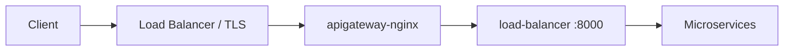

# pumpwood-deploy-ingress-api-gateway

Satellite deploy package for the **Pumpwood NGINX API gateway** on
Kubernetes. It generates ingress manifests that add CORS and security
headers in front of Kong and your microservices — then hands them to
[`pumpwood-deploy`](https://github.com/Murabei-OpenSource-Codes/pumpwood-deploy)
for apply.

Developed by [Murabei Data Science](https://murabei.com). BSD-3-Clause.

<p align="center" width="60%">
   <br>

  <a href="https://en.wikipedia.org/wiki/Cecropia">
    Pumpwood is a native Brazilian tree
  </a> with a symbiotic relation to ants (Murabei)
</p>

---

## What it deploys

Two deploy classes cover the two common ingress patterns in Pumpwood
stacks:

| Class | TLS | LoadBalancer | Use when |
|-------|-----|--------------|----------|
| `ApiGatewayCertbot` | Let's Encrypt (Certbot) | Yes (external or internal) | NGINX terminates HTTPS on-cluster |
| `ApiGatewayServerCertificate` | Operator-managed (Gandi, etc.) | Yes (external or internal) | CA-issued cert mounted from Secret |
| `ApiGatewayNoCertificate` | None (HTTP only) | ClusterIP Service in manifest | TLS is handled by AWS ALB, GCP LB, etc. |

### Manifests produced

**`ApiGatewayCertbot`** — 2 deploy objects:

| Manifest | Kubernetes resources |
|----------|----------------------|
| `nginx_certbot_gateway__deploy` | Deployment `apigateway-nginx` |
| `nginx_certbot_gateway__endpoint` | Service `apigateway-nginx` (LoadBalancer) |

**`ApiGatewayNoCertificate`** — 1 deploy object:

| Manifest | Kubernetes resources |
|----------|----------------------|
| `nginx_no_ssl_gateway__deploy` | Deployment `apigateway-nginx-no-ssl` + Service `apigateway-nginx` (ClusterIP) |

### Request flow



NGINX adds CORS and security headers. Kong routes traffic to auth,
datalake, and other Pumpwood services.

---

## Prerequisites

This package does **not** stand alone. Deploy it **after**
`StandardMicroservices` (Kong, RabbitMQ, storage) so the upstream Kong
service exists:

| Upstream | Default target | Port |
|----------|----------------|------|
| Kong proxy | `load-balancer` | `8000` |
| Kong health | `load-balancer` | `8001` |

For `ApiGatewayCertbot`, you also need:

- A **reserved static IP** matching `gateway_public_ip`
- DNS pointing `server_name` to that IP (for Let's Encrypt validation)
- A valid **contact email** for certificate registration

For `ApiGatewayNoCertificate` on AWS, pair it with
[`pumpwood-deploy-ingress-aws`](https://github.com/Murabei-OpenSource-Codes/pumpwood-deploy-ingress-aws)
(`IngressALB`) targeting service `apigateway-nginx` on port 80.

---

## Installation

```bash
pip install pumpwood-deploy-ingress-api-gateway
```

Requires `pumpwood-deploy` and `jinja2`.

---

## Quick start

### Option A — HTTPS with Certbot (on-cluster TLS)

```python
import os
from dotenv import load_dotenv
from pumpwood_deploy.deploy import DeployPumpWood
from pumpwood_deploy_api_gateway import ApiGatewayCertbot

load_dotenv()

deploy = DeployPumpWood(...)

deploy.add_microservice(
    ApiGatewayCertbot(
        gateway_public_ip="203.0.113.10",
        email_contact="ops@example.com",
        version=os.getenv("API_GATEWAY_SSL"),
        server_name="app.example.com",
        repository="my-registry.example.com/",
        health_check_url="health-check/pumpwood-auth-app/",
        root_redirect_url="admin/pumpwood-auth-app/gui/",
        source_ranges=["0.0.0.0/0"],
    ))

deploy.create_deploy_files()
deploy.deploy_microservices()
```

Private `gateway_public_ip` values render an **internal** LoadBalancer
(GKE). Public values render an **external** LoadBalancer with optional
`loadBalancerSourceRanges` from `source_ranges`.

### Option B — HTTP gateway + cloud load balancer (AWS ALB)

Use NGINX for headers only; terminate TLS at the ALB:

```python
import os
from pumpwood_deploy.deploy import DeployPumpWood
from pumpwood_deploy_api_gateway import ApiGatewayNoCertificate
from pumpwood_deploy_ingress_aws import IngressALB

deploy = DeployPumpWood(...)

deploy.add_microservice(
    ApiGatewayNoCertificate(
        version=os.getenv("API_GATEWAY"),
        repository="my-registry.example.com/",
        health_check_url="health-check/pumpwood-auth-app/",
    ))

deploy.add_microservice(
    IngressALB(
        alb_name="pumpwood-alb",
        group_name="pumpwood",
        health_check_url="/health-check/pumpwood-auth-app/",
        certificate_arn="arn:aws:acm:...",
        host="app.example.com",
        service_name="apigateway-nginx",
        service_port=80,
    ))

deploy.create_deploy_files()
deploy.deploy_microservices()
```

### Option C — HTTPS with Gandi or external CA

Generate CSR and key files with the helper CLI (see ``certs/README.md``):

```bash
python -m pumpwood_deploy_api_gateway.tls_certificate generate-csr \
  --server-name app.example.com \
  --output-dir certs
```

After Gandi issues the certificate, build the NGINX chain:

```bash
python -m pumpwood_deploy_api_gateway.tls_certificate build-chain \
  --leaf certs/gandi_domain.crt \
  --intermediate certs/gandi_intermediate.crt \
  --output certs/certificate.crt
```

```python
import os
from pumpwood_deploy.deploy import DeployPumpWood
from pumpwood_deploy_api_gateway import ApiGatewayServerCertificate

deploy.add_microservice(
    ApiGatewayServerCertificate(
        gateway_public_ip="203.0.113.10",
        version=os.getenv("API_GATEWAY_SSL_SERVER"),
        server_name="app.example.com",
        certificate_crt_path="certs/certificate.crt",
        certificate_key_path="certs/certificate.key",
        repository="my-registry.example.com/",
    ))
```

### Environment variables

```bash
API_GATEWAY_SSL=1.2.0    # pumpwood-nginx-ssl-gateway (Certbot)
API_GATEWAY_SSL_SERVER=4.3  # nginx-ssl-server-certificate (Gandi)
API_GATEWAY=1.2.0        # pumpwood-nginx-without-ssl (no TLS)
```

If the rendered manifest matches the cluster, `kubectl apply` produces
no changes — safe for rolling image updates.

---

## Configuration reference

### `ApiGatewayCertbot`

| Parameter | Required | Default | Description |
|-----------|----------|---------|-------------|
| `gateway_public_ip` | Yes | — | Static IP for LoadBalancer |
| `email_contact` | Yes | — | Let's Encrypt contact email |
| `version` | Yes | — | Image tag for `pumpwood-nginx-ssl-gateway` |
| `server_name` | No | `not_set` | DNS name for NGINX / Certbot |
| `repository` | No | GCR default | Docker registry |
| `health_check_url` | No | auth health path | Readiness probe on port 80 |
| `root_redirect_url` | No | auth admin GUI | Redirect target for `/` |
| `source_ranges` | No | `0.0.0.0/0` | Allowed CIDRs for external LB |

### `ApiGatewayServerCertificate`

| Parameter | Required | Default | Description |
|-----------|----------|---------|-------------|
| `gateway_public_ip` | Yes | — | Static IP for LoadBalancer |
| `version` | Yes | — | Image tag for `nginx-ssl-server-certificate` |
| `certificate_crt_path` | Yes | — | Path to `certificate.crt` PEM chain |
| `certificate_key_path` | Yes | — | Path to `certificate.key` private key |
| `server_name` | No | `not_set` | DNS name for NGINX |
| `repository` | No | GCR default | Docker registry |
| `secret_name` | No | `apigateway-nginx-ssl` | Kubernetes Secret name |
| `health_check_url` | No | auth health path | Readiness probe on port 80 |
| `root_redirect_url` | No | auth admin GUI | Redirect target for `/` |
| `source_ranges` | No | `0.0.0.0/0` | Allowed CIDRs for external LB |

### `ApiGatewayNoCertificate`

| Parameter | Required | Default | Description |
|-----------|----------|---------|-------------|
| `version` | Yes | — | Image tag for `pumpwood-nginx-without-ssl` |
| `repository` | No | GCR default | Docker registry |
| `health_check_url` | No | auth health path | Readiness probe on port 80 |
| `root_redirect_url` | No | auth admin GUI | Redirect target for `/` |
| `server_name` | No | `localhost` | NGINX `server_name` |
| `target_service` | No | `load-balancer:8000` | Kong proxy upstream |
| `target_health` | No | `load-balancer:8001` | Kong health upstream |

---

## Health check

Both variants expose a readiness probe on **port 80**. The default
path is:

```
GET /health-check/pumpwood-auth-app/
```

Use this path for LoadBalancer, ALB, and ingress health checks. Auth is
the usual canary because it is deployed early in most Pumpwood stacks.

Root `/` redirects to the auth admin GUI by default
(`admin/pumpwood-auth-app/gui/`).

---

## Choosing a variant

| Scenario | Recommended class |
|----------|-------------------|
| Bare-metal / VM cluster with public IP | `ApiGatewayCertbot` |
| Gandi or corporate CA certificate | `ApiGatewayServerCertificate` |
| GKE with internal-only access | `ApiGatewayCertbot` (private IP) |
| AWS with ACM certificate on ALB | `ApiGatewayNoCertificate` + `IngressALB` |
| Dev cluster behind corporate proxy | `ApiGatewayNoCertificate` |

---

## Migration note

Older Pumpwood deploy scripts imported `CORSTerminaton` from the
monolithic `pumpwood-deploy` package. That class is now
`ApiGatewayNoCertificate` in this satellite package:

```python
# Before
from pumpwood_deploy.microservices.api_gateway.deploy import CORSTerminaton

# After
from pumpwood_deploy_api_gateway import ApiGatewayNoCertificate
```

---

## Related packages

| Package | Role |
|---------|------|
| [`pumpwood-deploy`](https://github.com/Murabei-OpenSource-Codes/pumpwood-deploy) | Orchestrator, Kong, RabbitMQ, storage |
| [`pumpwood-deploy-auth`](https://github.com/Murabei-OpenSource-Codes/pumpwood-deploy-auth) | Auth microservice (health-check default) |
| [`pumpwood-deploy-ingress-aws`](https://github.com/Murabei-OpenSource-Codes/pumpwood-deploy-ingress-aws) | AWS ALB ingress (pairs with no-cert gateway) |

Full platform documentation:
[Murabei Open Source — pumpwood-deploy](https://murabei-opensource-codes.github.io/pumpwood-deploy/).

---

## Development

```bash
pip install -e ../pumpwood-deploy
pip install -e .

ruff check src/
```

---

## License

BSD-3-Clause — see [LICENSE](LICENSE).
